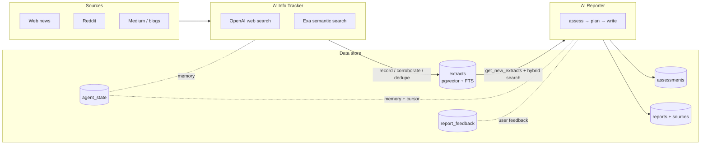

# Agentic backend: Info Tracker + Reporter

How Proactive keeps a topic up to date. The old fixed 9-call pipeline was
replaced by **two autonomous agents** built on the OpenAI Agents SDK
([`@openai/agents`](https://github.com/openai/openai-agents-js)), sharing a
persistent, hybrid-searchable extract store in Supabase (pgvector + Postgres
full-text search).



## The two agents

### Info Tracker — `src/lib/agents/tracker/`

**Goal: find what is new for each topic and record it.** Runs decoupled from
reporting, for ALL active topics (including manual-frequency ones).

- **Tools:** hosted OpenAI `web_search`; `exa_search` (Exa semantic web
  search — discussions, blogs, analysis that keyword search misses);
  `search_existing_extracts` (hybrid search, check-before-record);
  `record_extract`; `corroborate_extract`.
- **Memory** (`agent_state`, agent=`tracker`): `recent_subtopics` — the
  currently-active subtopics it reports at the end of each run, injected into
  the next run's instructions.
- **Dedupe:** extracts are unique per `(topic_id, canonical_url)`
  (`normalizeUrl` strips protocol/www/tracking params). A repeat record
  merges as a corroboration (`corroborations` + `corroborating_urls`) —
  concurrent runs are race-safe via the DB unique constraint.
- **Budget:** `maxTurns` 12 (8 when run inline from the generate route), at
  most ~2 web + 3 Exa searches and 10 extracts per run (prompt-enforced).

### Reporter — `src/lib/agents/reporter/`

**Goal: ensure the user is up to date.** Runs on the topic's frequency (daily
Vercel cron) or on demand, against an already-created `reports` row.

- **Tools:** `get_new_extracts` (everything after its cursor — primary feed);
  `search_extracts` (hybrid search for background/corroboration);
  `record_assessment` (what each significant extract means, high/medium/low);
  `get_recent_assessments`.
- **Memory** (`agent_state`, agent=`reporter`): `recent_subtopics` +
  `cursor` — the max `extracts.created_at` it has processed ("where it
  stopped"). The cursor only advances on successful runs, so failed runs
  re-assess the same extracts.
- **Feedback:** the last 5 `report_feedback` rows (thumbs + comment, entered
  under each report) are injected into the run input with instructions to
  adjust emphasis/format.
- **Citations:** the agent cites **extract ids**; `reporter/compose.ts`
  converts to the UI's positional contract — distinct cited extracts in
  first-appearance order become the per-report `sources` snapshot (inserted
  with explicit millisecond `created_at` offsets so `.order("created_at")`
  is deterministic), and ids become `source_refs` indexes. `sanitizeDraft`
  still drops hallucinated refs and caps `**entity**` markers.
- After completion the run advances the cursor, saves subtopic memory, and
  the route runs the **experts** (Mentor/Analyst/Sentiment/Personality)
  unchanged — they read `reports.sections` and the per-report `sources`
  snapshot.

## Scheduling (fully decoupled)

| What | Trigger | Cadence | Route |
| --- | --- | --- | --- |
| Info Tracker | Supabase **pg_cron + pg_net** | every 6 h (`0 */6 * * *`) | `GET /api/cron/tracker` |
| Reporter | Vercel cron (`vercel.json`) | daily 08:00 UTC, honors topic frequency | `GET /api/cron` |
| Both | User taps **Generate Update** | on demand | `POST /api/topics/[id]/generate` |

The generate route runs the tracker inline first **only when stale** (last
tracker run > 60 min ago), then the reporter — repeat clicks stay cheap.
Both cron routes authenticate with `Authorization: Bearer ${CRON_SECRET}`.

### One-time pg_cron setup (manual)

Migration `0011_tracker_cron.sql` enables `pg_cron` + `pg_net`. The schedule
itself needs your deployed URL and secret, stored in Supabase Vault — run
once in the SQL editor (full template in the migration file):

```sql
select vault.create_secret('https://<your-app>.vercel.app', 'app_base_url');
select vault.create_secret('<CRON_SECRET value>', 'app_cron_secret');
select cron.schedule('info-tracker', '0 */6 * * *', $job$ ... $job$);
```

Inspect with `select * from cron.job;` and
`select * from net._http_response order by created desc limit 10;`.
Rotating `CRON_SECRET` means updating the `app_cron_secret` vault secret too.

## Data store

New tables (migration `0010_extracts.sql`), all RLS `auth.uid() = user_id`:

- **`extracts`** — the persistent topic-scoped corpus: source fields +
  `canonical_url` (unique per topic), `embedding vector(1536)`
  (text-embedding-3-small), generated `fts tsvector` (title+gist),
  corroboration fields. Indexes: `(topic_id, created_at desc)`, GIN(fts),
  HNSW cosine on embedding.
- **`assessments`** — the Reporter's per-extract judgements, linked to the
  report that produced them.
- **`agent_state`** — PK `(topic_id, agent)`, jsonb memory per agent.
- **`report_feedback`** — thumbs + comment, unique per `(report_id, user)`.

**Hybrid search:** `search_extracts_hybrid(topic, query, embedding, …)` —
full-text ranking and cosine ranking merged with Reciprocal Rank Fusion
(k=50), security-invoker so RLS applies to user-scoped clients. Called via
`supabase.rpc` from `extract-store.ts`; if embedding fails, the store falls
back to recency + keyword filtering so a run never blocks on embeddings.

The old per-report `sources` table is still written (the citation snapshot
each report renders from) — historical reports keep their citations, and the
Analyst expert keeps its evidence query. Old sources were **not** backfilled
into `extracts`; the tracker repopulates each topic within one cycle.

## Module map — `src/lib/agents/`

| File | Purpose |
| --- | --- |
| `client.ts` | Shared openai@6 client, Agents SDK wiring (Responses API, tracing off), model tiers |
| `embeddings.ts` | `Embedder` + OpenAI impl (batched, usage-recorded) |
| `exa.ts` | `ExaSearcher` + exa-js impl |
| `extract-store.ts` | `ExtractStore` interface + Supabase and in-memory impls |
| `report-store.ts` | `ReporterPersistence` — report-row lifecycle (status/stage/sources/complete/fail) |
| `schemas.ts` | zod v4 tool params + `TrackerFinal` / `ReporterFinal` output schemas |
| `usage-adapter.ts` | SDK run results → existing usage/trace collectors (`reports.usage` / `reports.trace`) |
| `tracker/` `reporter/` | `tools.ts` (pure impls), `agent.ts` (Agent + tool wiring), `run.ts` (orchestration) |

Kept from the old pipeline: `ai/dedupe.ts` (normalizeUrl), `ai/freshness.ts`,
`ai/images.ts` (hero image), `ai/usage.ts`, `ai/trace.ts`, `ai/openai.ts` +
`ai/llm.ts` (the `Llm` seam — still used by experts and news-query), all of
`ai/experts/`. Deleted: planner, seeker, extractor, reporter, memory,
pipeline, schemas.

## Model tiers & cost

| Tier | Env var | Default | Used by |
| --- | --- | --- | --- |
| Search | `OPENAI_SEARCH_MODEL` | `gpt-5-mini` | Info Tracker, experts' mechanical calls |
| Report | `OPENAI_REPORT_MODEL` | `gpt-5` | Reporter, Analyst, Personality stance updates |
| Embedding | `OPENAI_EMBEDDING_MODEL` | `text-embedding-3-small` | extract/query embeddings |

Usage (tokens, web-search calls, embeddings) is recorded per report to
`reports.usage`; the trace (`reports.trace`) now shows one entry per **agent
turn** (`agent_turn:reporter (2/5)`) plus one per **tool call**
(`tool:record_extract`) — rendered on the usage and prompts pages as before.
Tracker cron runs have no report row; their usage is logged to the function
console. Exa calls are not in the cost estimate (see your Exa dashboard).

## Environment variables

| Var | Required | Purpose |
| --- | --- | --- |
| `OPENAI_API_KEY` | yes | all model + embedding calls |
| `EXA_API_KEY` | yes (tracker) | Exa semantic search |
| `CRON_SECRET` | yes | both cron routes + pg_cron vault secret |
| `OPENAI_SEARCH_MODEL` / `OPENAI_REPORT_MODEL` / `OPENAI_EMBEDDING_MODEL` | no | model overrides |
| `OPENAI_PRICING_JSON` | no | cost-estimate price table override |
| `BRAVE_SEARCH_API_KEY` / `SERPAPI_API_KEY` | no | related-news feature |

## Resilience

| Failure | Behavior |
| --- | --- |
| Tracker run fails | Returned as `ok:false`, logged; no report row involved; next scheduled run retries |
| Inline tracker fails (generate) | Non-fatal — reporter runs on existing extracts |
| Embedding fails | Extract saved without embedding (keyword search still finds it); hybrid search falls back to keyword |
| Reporter agent fails / no output | `reports.status='error'` + message; usage still persisted; cursor not advanced |
| Hero image fails | Report completes without an image |
| Cursor/memory save fails | Logged; the completed report is not rolled back |
| Concurrent runs | Report lock (10 min) unchanged; extract writes race-safe via unique upsert |

## Testing

All offline (`npm test`): pure tool implementations and stores are injected
(`createInMemoryExtractStore`, stub `ExaSearcher`/`Embedder`), and
`tests/agent-runs.test.ts` drives both agents end-to-end through the real
Agents SDK loop against a scripted fake `Model` registered via
`setDefaultModelProvider` (note: the SDK's default runner captures the
provider on first `run()`, so tests swap the model behind one provider).
