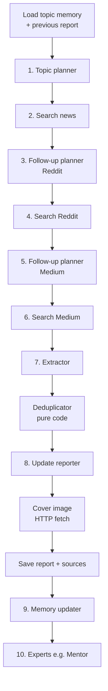

# Report generation pipeline

How Proactive turns a topic into a briefing. One run of this pipeline is what
happens when a user taps **Generate Update**, or when the daily cron picks up
a topic that is due.

Every step is a separate service module under [`src/lib/ai/`](../src/lib/ai/),
orchestrated by `runReportPipeline` in
[`pipeline.ts`](../src/lib/ai/pipeline.ts). The order is fixed in code — no
module decides what runs next.

Boxes with numbers are OpenAI calls; the rest is plain code. A full run is
**9 model calls**, or 10 with a Mentor attached.

## Model tiers

Two configurable tiers, resolved in [`openai.ts`](../src/lib/ai/openai.ts):

| Tier | Env var | Used by | Rationale |
| --- | --- | --- | --- |
| Search | `OPENAI_SEARCH_MODEL` | Steps 1–7, 9, 10 | Planning, searching, structured extraction — mechanical work |
| Report | `OPENAI_REPORT_MODEL` | Step 8 only | The one output a human reads, so it gets the stronger model |

All calls use the OpenAI **Responses API** with **structured outputs** (Zod
schemas via `zodTextFormat`), so no module ever parses free text. Only the
three search steps attach the `web_search_preview` tool.

## Before the first call

The pipeline loads two things that make the run *incremental* rather than a
fresh summary each time:

- **Topic memory** (`topic_memory`) — developments the user has already been
  told, emerging themes, durable facts with confidence levels, and open
  questions.
- **The previous report** — the most recent `ready` report for this topic.

Both feed later steps so the run can answer "what is genuinely new?" instead
of re-reporting the same ground.

## Step 1 — Topic planner

**Module:** [`planner.ts`](../src/lib/ai/planner.ts) · **Schema:** `search_plan`

Converts the user's own words into machine queries.

- **Receives:** today's date, topic title, the "I want to know" description,
  and the key interest areas.
- **Produces:** separate query sets for news, Reddit and Medium.
- **Constraints:** queries target the topic's freshness window — derived
  from its update frequency (daily → 1 day, every 3 days → 3, weekly/manual
  → 7) — stay under 10 words, and carry no `site:` operators. The same
  window is enforced in code after extraction: sources verifiably older
  than the cutoff are dropped (unknown dates are kept).

## Steps 2, 4, 6 — Information seeker

**Module:** [`seeker.ts`](../src/lib/ai/seeker.ts) · **Schema:** `seek_result` ·
**Uses web search**

The same module runs three times, once per channel, with different guidance:

| Channel | Looking for | Publisher recorded as |
| --- | --- | --- |
| News | Reported developments from reputable outlets, excluding reddit.com and medium.com | Publication |
| Reddit | Substantive community discussion, not empty link posts | Subreddit |
| Medium | Practitioner analysis and hands-on writing | Author or publication |

- **Produces:** up to 6 sources per channel, each with title, URL, publisher,
  publication date and a snippet.
- **Grounding rule:** only sources actually returned by the search tool; the
  model is explicitly forbidden from inventing URLs, titles or dates.
- **Cost control:** at most **one** web search call per channel — each call
  is separately billed *and* pulls the fetched pages in as input tokens.

## Steps 3, 5 — Follow-up planner (the cascade)

**Module:** [`planner.ts`](../src/lib/ai/planner.ts) · **Schema:** `followup_queries`

This is what makes the community and practitioner channels track *today's*
news rather than the topic in general.

- **Receives:** the titles and snippets the news search actually found.
- **Produces:** queries aimed at reaction to those specific developments —
  e.g. news surfaces "Kimi K3 released", so Reddit is searched for reaction to
  Kimi K3 rather than generic "LLM release discussion".
- **Balance:** one targeted query plus one broad query from the original plan,
  so coverage beyond the day's headlines isn't lost.
- **Skipped entirely** (no model call) when the news search found nothing, or
  when the call fails — the originally planned queries are used instead.

## Step 7 — Extractor

**Module:** [`extractor.ts`](../src/lib/ai/extractor.ts) · **Schema:** `extraction_result`

Turns raw findings into structured records, and makes the judgment the whole
product depends on.

- **Receives:** every found source across all three channels, *plus* the
  developments already reported to this user and the facts already known.
- **Produces**, per source: source type, title, publisher, URL, publication
  date, a factual gist, why it's relevant to this topic, a **novelty verdict**,
  and any **contradiction** with prior knowledge.
- **Novelty verdict** — the heart of it:
  - `new` — the user has not been told about this
  - `update` — meaningfully develops something already reported
  - `repeat` — restates what is already known
- Irrelevant sources are dropped by omission.

These records are what get stored in the `sources` table and shown on the
**Extracts** page.

## Deduplicator (no model call)

**Module:** [`dedupe.ts`](../src/lib/ai/dedupe.ts) — pure functions, unit-tested.

Two passes:

1. **URL identity** — normalize (strip protocol, `www.`, tracking parameters,
   trailing slash) and drop exact duplicates.
2. **Near-duplicate titles** — within the same channel, Jaccard token
   similarity ≥ 0.6 counts as the same story; the version with the richer gist
   survives.

Deliberately deterministic: syndicated coverage of one event shouldn't cost a
model call to collapse.

## Step 8 — Update reporter

**Module:** [`reporter.ts`](../src/lib/ai/reporter.ts) · **Schema:** `report_draft`
· **Report tier**

Writes the briefing itself.

- **Receives:** the deduped extracts (indexed, so bullets can cite them), the
  previous report and its date, topic memory, and the user's detail level
  (brief / standard / deep, which sets bullets per section).
- **Produces:** Overall Takeaway, Latest Developments, Community Reaction,
  Practitioner View, What Changed, a one-line summary, and a
  `no_meaningful_change` flag.

**Editorial rules enforced in the prompt:**

- Focus on what is new; never re-report known facts without a meaningful update.
- News carries reported developments; Reddit is community reaction and is
  never presented as verified fact; Medium is practitioner interpretation and
  not authoritative by default.
- Distinguish confirmed from speculative, and state uncertainty explicitly.
- Surface disagreements between sources.
- Every bullet must cite supporting sources by index.
- Mark at most two key entities per bullet with `**asterisks**` for
  highlighting.

**Post-processing (`sanitizeDraft`, code not model):** any bullet whose
citations all point outside the sources array is **dropped** — an
anti-hallucination guard — and excess entity markers are unwrapped.

## Cover image (no model call)

**Module:** [`images.ts`](../src/lib/ai/images.ts)

Sources are ranked by how much the report leans on them (a citation in Latest
Developments counts triple). The top-ranked pages are fetched over plain HTTP
and their `og:image` / `twitter:image` meta tags read, along with
`og:image:alt` for the caption. First usable image wins, up to 5 attempts.

Images therefore always come from the report's own sources — the model never
supplies an image URL. Failure is silent; the report simply has no cover.

## Persistence

Sources are written to `sources`, the report row flips to `ready` with its
sections and summary, and the topic's `last_generated_at` is stamped. From
this point the user can see the report even if later steps fail.

## Step 9 — Memory updater

**Module:** [`memory.ts`](../src/lib/ai/memory.ts) · **Schema:** `memory_update`

Folds the run into long-term memory so the *next* report knows what this one
said.

- **Receives:** current memory, the new report as plain text, and the extracts.
- **Produces a delta, not a rewrite:** `new_developments`, `new_facts`,
  `obsolete_facts`, `new_themes`, `obsolete_themes`, `new_questions`,
  `resolved_questions`. Anything omitted is preserved.
- **Merged in code** by `mergeMemoryDelta` — case-insensitive dedup,
  preserving each development's original first-reported timestamp, and
  enforcing caps of 60 developments / 30 facts / 12 themes / 12 questions.

Revising a fact is expressed as obsolete + new; restating a theme replaces it,
so a trend can change direction.

## Step 10 — Experts

**Module:** [`experts/runner.ts`](../src/lib/ai/experts/runner.ts)

After the report is saved, every **active** expert attached to the topic reads
it and appends its own output below the report. The runner dispatches on
expert kind, so new kinds plug in without touching the pipeline.

**Mentor** ([`experts/mentor.ts`](../src/lib/ai/experts/mentor.ts), schema
`mentor_tips`) is the first kind: it explains concepts the report *assumes* —
what an acronym means, how two named people relate — at a configurable level
(basic / intermediate / advanced). It keeps its own memory of what it taught,
and respects feedback: "I know this" retires a concept permanently, "Remind me
again" queues it to return.

## Resilience rules

The pipeline degrades rather than failing wherever the user still gets value:

| Failure | Behaviour |
| --- | --- |
| One search channel fails | That channel returns no sources; the run continues |
| Follow-up planning fails | Falls back to the originally planned queries |
| No sources found at all | Extractor returns early without a model call |
| Cover image unavailable | Report saves without one |
| Memory update fails | The already-saved report is unaffected |
| An expert fails | Other experts still run; report unaffected |
| Any core step fails | Report row is marked `error` with the message, surfaced on the briefing screen |

Concurrency is guarded per topic: a second generation started within 10
minutes of one still running is rejected with HTTP 409. Stale locks older than
that are treated as crashed runs.

## Observability

Every model call passes through one wrapper, which records:

- **Usage** (`reports.usage`) — calls, input/output tokens, web searches, a
  per-model breakdown, and an estimated cost. Shown on the **Tokens** page.
- **Trace** (`reports.trace`) — each call in order with its stage, model,
  full instructions and input, tokens, duration and any error. Shown on the
  **Prompts** page.

Costs are estimates from a price table in
[`usage.ts`](../src/lib/ai/usage.ts), overridable via `OPENAI_PRICING_JSON`.
Token counts are exact, as reported by the API.
